# Online Store with Mini-Game

This project is a web application that combines an **online store** with a **mini-game**. Users can engage in the mini-game to earn virtual currency and spend it in the store to purchase various functionalities.

---

## Features

### 🕹️ Mini-Game: Money Maker
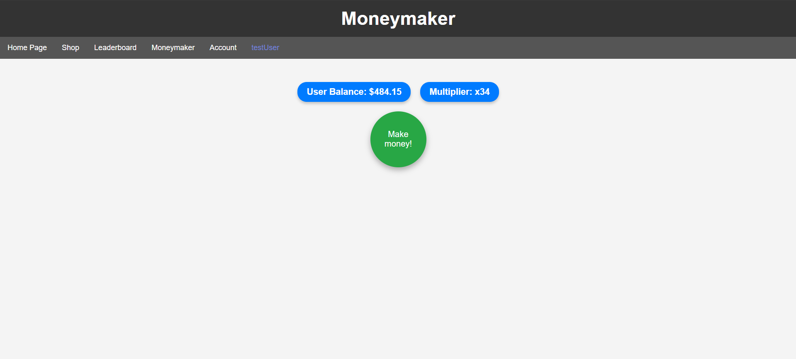
- **Click to Earn**: Players click a button to earn virtual coins.
- **Multipliers**: Coins per click can be increased by purchasing multipliers, enabling faster progress.

### 🛒 Online Store
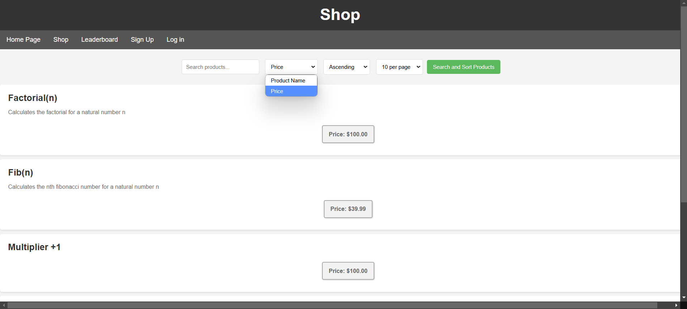
- **Purchase Functions**: The store offers a range of functions that process user-provided input and return corresponding results.
- **Cart and Checkout**: Includes cart management and a smooth checkout process.

### 📊 Leaderboards
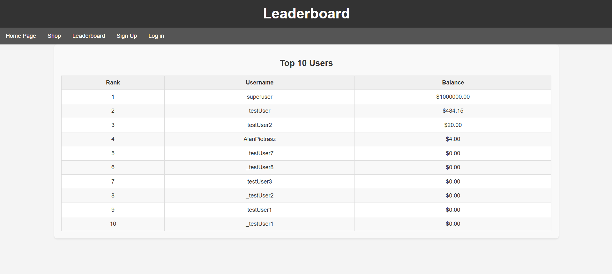
- Track and display the top-performing players based on their earnings in the mini-game.

### 👤 User Management

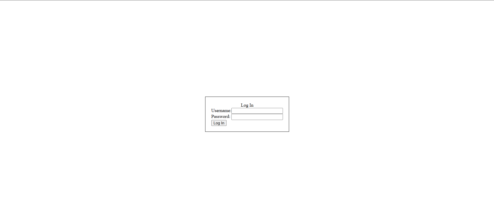
- **Sign-Up & Login**: Secure user authentication system.
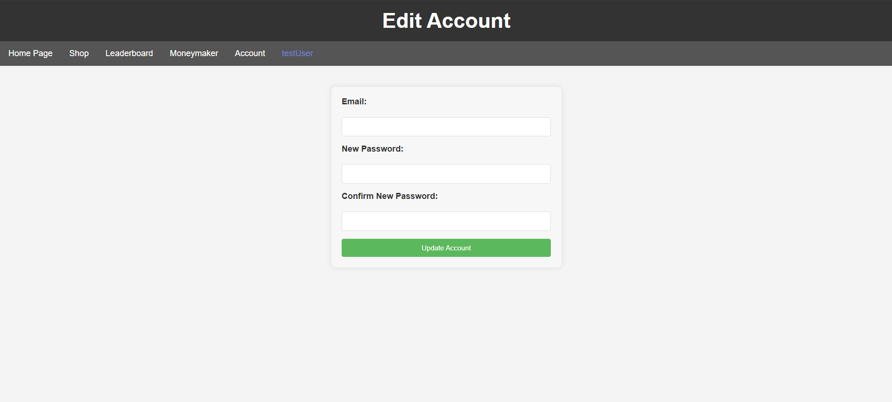
- **Account Management**: Users can edit their profiles.

---

## Buying Example
1. **Select Product**: Choose a product in the store.
   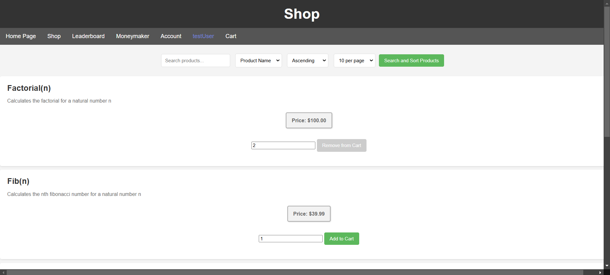

2. **Add to Cart**: Review the cart and proceed to checkout.
   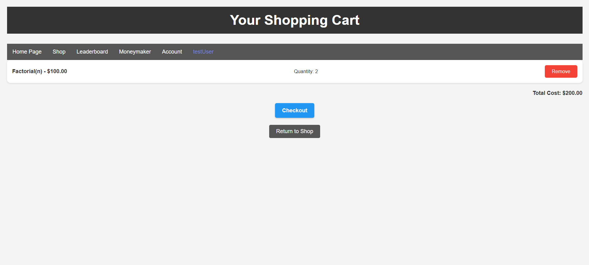

3. **Complete Checkout**: Finalize the purchase.
   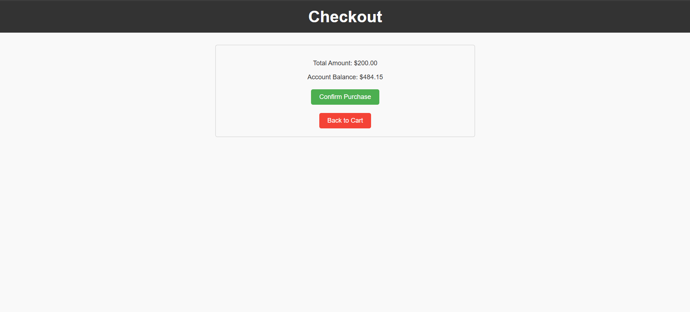

4. **Success Message**: Confirmation of purchase.
   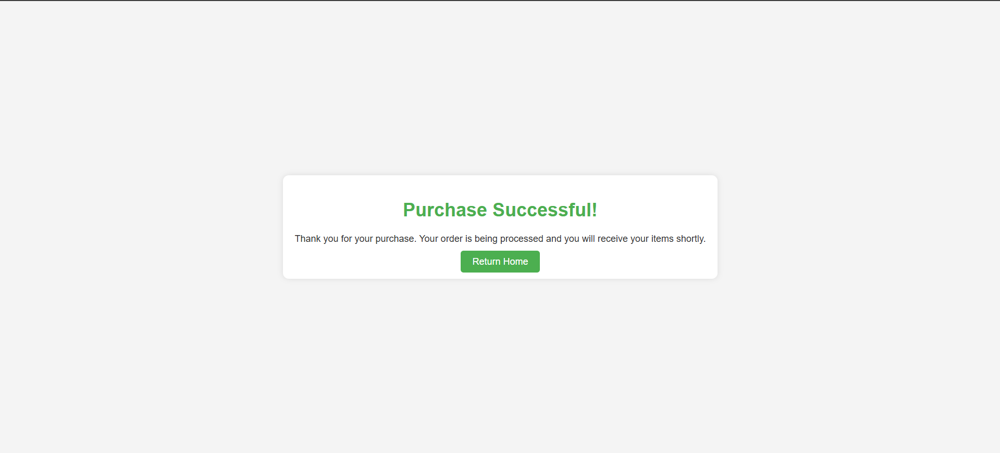

5. **Use the Product**: Download and use the purchased function.
   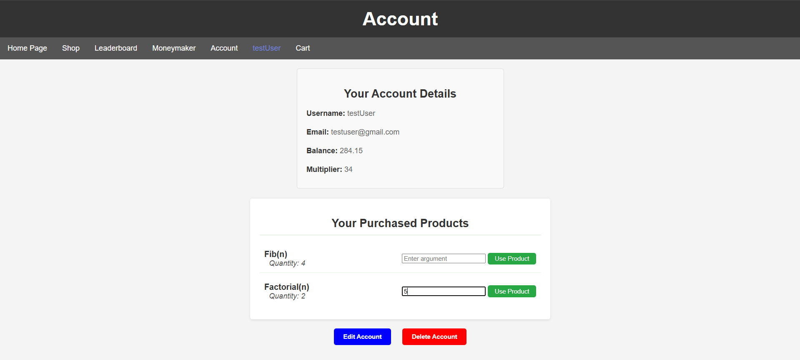

6. **Result**: Example output of a purchased function.
   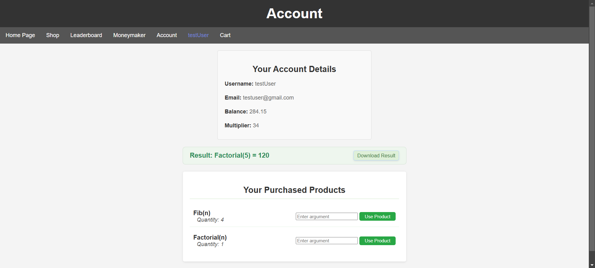

Content of downloaded file "Factorial(n)-result-with-arg-5.txt":
```
Result for product Factorial(n) with argument (5): 120
```


---

## Project Structure

### Core Files and Directories
- **`app.js`**: Main application file that sets up the server and routes.
- **`db.js`**: Handles database connections and queries.
- **`functions.js`**: Houses the functions users can purchase from the shop.
- **`repositories.js`**: Repository layer for database operations.
- **`authorize.js`**: Middleware for user authentication and authorization.
- **`playwright.config.ts`**: Configuration for end-to-end testing using Playwright.

### Frontend Static Files (`./static`)
Contains CSS files for styling various pages:
- **Account and Product Management**: `accountstyle.css`, `editproductstyle.css`
- **Mini-Game**: `moneymakerstyle.css`
- **Shop and Cart**: `shopstyle.css`, `cartstyle.css`
- **Common Pages**: `style.css`, `leaderboard.css`, and more.

### Templates (`./views`)
Server-side templates built using **EJS**:
- Mini-game: `moneymaker.ejs`
- Storefront: `shop.ejs`
- Authentication: `login.ejs`, `signup.ejs`
- User Settings: `account.ejs`, `edit-account.ejs`
- Error Handling: `404.ejs`, `error.ejs`

### Tests (`./tests` and `./tests-examples`)
- Comprehensive tests written in **Playwright** to ensure app reliability:
  - Login/Logout: `test-1-login.spec.ts`, `test-2-logout.spec.ts`
  - Shop and Cart: `test-7-shop-search.spec.ts`, `TODO-test-8-shop-cart.spec.ts`
  - Leaderboard: `test-4-leaderboard.spec.ts`
- Examples: `./tests-examples/demo-todo-app.spec.ts`

---

## Installation

### Prerequisites
- **Node.js** (>=16.x)
- **npm**

### Steps
1. Clone the repository:
   ```bash
   git clone <repository-url>
   cd <repository-directory>
   ```
2. Install dependencies:
   ```bash
   npm install
   ```
3. Set up the database and environment variables (if required).
4. Start the server:
   ```bash
   npm start
   ```

---

## Running Tests
End-to-end tests are implemented using **Playwright**:
1. Run tests:
   ```bash
   npx playwright test
   ```

2. View detailed test reports:
   ```bash
   npx playwright show-report
   ```
